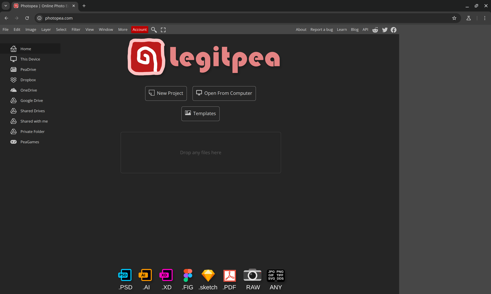

⚠️⚠️ This app does **NOT** redistribute **ANY** content from the original [photopea](https://www.photopea.com/) website,
and is **NOT IN ANY WAY** affiliated with them. ⚠️⚠️

**Also, please consider supporting the [photopea](https://www.photopea.com/) team by buying to their premium subscritpion!**

---

This work by opening the original website in a virtual browser, and caching all assets for future use.



---

> This application is more of a proof of concept than anything.
>
> Things are rough, there is no error handling or type safety, and it will most likely stay this way.
>
> Also, I cannot guarantee that it will work in the future.

## Setup

```shell
npm i
npx playwright install chromium
```

## Run

```shell
npm run start
```

On first execution, the app will cache every loaded assets and place them and their response headers in the `cache`
directory.

You can use the `cache_overwrite` directory to, as the name implies override assets.

If you forever want to use the same exact version, you can copy the whole `cache` directory content into
`cache_overwride`.
